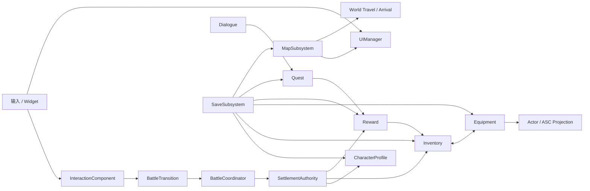

# HSR 子系统架构、接口与调用指南

> 适用基线：UE 5.6，`TASK-P17-PATCH-03H` 归档后的单机架构。
>
> 目标：说明各领域的状态所有权、公开接口、跨系统调用顺序、扩展边界与常用调用方式。

## 目录

1. [核心原则](#1-核心原则)
2. [生命周期与所有权](#2-生命周期与所有权)
3. [GameInstance 领域子系统](#3-gameinstance-领域子系统)
4. [LocalPlayer UI](#4-localplayer-ui)
5. [World 与 Battle Runtime](#5-world-与-battle-runtime)
6. [通用调用模板](#6-通用调用模板)
7. [调用决策表](#7-调用决策表)
8. [可扩展性评价](#8-可扩展性评价)
9. [新增功能检查清单](#9-新增功能检查清单)
10. [代码索引](#10-代码索引)

## 1. 核心原则

HSR 不使用一个可以任意修改所有状态的全局管理器。每个 Domain 只保留一个权威，跨系统协作只传递稳定 ID、纯值 Request/Result、Revision 和类型化事件。

统一操作形状：

```text
Input / Interaction / Widget
-> pure-value Intent
-> authority preflight
-> candidate construction
-> complete validation
-> one authoritative commit
-> typed Result + Revision / TransactionId
-> committed event
-> ViewModel reads a new Snapshot
-> Widget presentation
```

失败应在 Commit 前保持零污染。Commit 完成后，UI 显示失败不回滚已经成功的业务事务，而是依据 TransactionId/Revision 重新读取权威快照。

以下对象不进入 Save，也不作为跨地图稳定身份：

- Actor、Pawn、Widget。
- ASC、GameplayEffect Handle、Delegate Handle。
- UObject 地址和当前 World 指针。

## 2. 生命周期与所有权

| 生命周期 | 典型对象 | 拥有内容 |
|---|---|---|
| Static Definition | Character/Item/Equipment/Reward/Quest/Map DataAsset | 静态规则、显示数据、软引用 |
| GameInstance | Profile、Party、Inventory、Equipment、Reward、Quest、Map、Save、BattleTransition | 跨 World 状态、稳定 ID、Revision、事务账本 |
| LocalPlayer | UIManager、ScreenStack、FrontendRouter | UI Session、输入、焦点、Widget/ViewModel 生命周期 |
| World/Battle | InteractionComponent、BattleCoordinator、TurnManager、Actor、ASC | 当前 World 或本场 Battle 的运行时投影 |
| Save Projection | Save DTO、Envelope、Generation | 已提交 Domain 的纯值快照 |



## 3. GameInstance 领域子系统

### 3.1 CharacterProfileSubsystem

源码：`Source/HSR/Progression/HSRCharacterProfileSubsystem.h`

职责：

- 注册角色 Definition/Catalog。
- 保存等级、经验、技能等级和 Runtime Revision。
- 为探索 Actor、Battle Actor 和 ASC 提供成长上下文。

主要接口：

```cpp
RegisterDefinition(...)
RegisterDefinitions(...)
RegisterLoadedCatalog(...)
GrantExperience(CharacterId, Experience)
SetSkillLevel(CharacterId, SkillId, Level)
GetProfileSnapshot(CharacterId, OutSnapshot)
GetProgressionContext(CharacterId, OutContext)
OnProfileChanged()
```

调用边界：

- 单独增加经验可以调用 `GrantExperience`。
- Battle Victory 同时包含经验和物品时，使用 `SettlementAuthority`。
- UI 读取 `GetProfileSnapshot`，监听 `OnProfileChanged`。

扩展方式：新角色优先添加 `UHSRCharacterDefinition` 和 Catalog 条目。新增持久化成长字段时，同时更新 Profile Snapshot、Save DTO、迁移、ASC Projection 和 Automation。

### 3.2 PartySubsystem

源码：`Source/HSR/Party/HSRPartySubsystem.h`

职责：保存当前队伍槽位，校验 CharacterId 是否拥有有效 Profile，并阻止重复角色。

主要接口：

```cpp
AddCharacter(CharacterId, PreferredSlot)
RemoveCharacter(Slot)
ReplaceCharacter(Slot, CharacterId)
SwapSlots(FirstSlot, SecondSlot)
GetSnapshot(OutSnapshot)
OnPartyChanged()
```

当前 `Capacity = 2`，Save schema 也冻结为两个槽位。扩展到四人队伍时，需要同步修改 Party 容量、Save codec/migration、UI、Battle participant 构建和测试夹具。

### 3.3 InventorySubsystem

源码：`Source/HSR/Inventory/HSRInventorySubsystem.h`

职责：

- 注册 Item Definition。
- 保存 Stack 和 Unique Instance。
- 校验容量、Stack Limit、StorageKind 和 Revision。
- 为 Reward、Equipment 和 Save 提供事务边界。

主要接口：

```cpp
CanRegisterDefinition(...)
RegisterDefinition(...)
AddStack(ItemId, Quantity)
RemoveStack(ItemId, Quantity)
AddUnique(Instance)
RemoveUnique(InstanceId)
ApplyGrants(Grants)
GetSnapshot(OutSnapshot)
OnInventoryChanged()
```

适合直接调用的场景：GM 命令、单领域消耗品、单独添加测试物品。

跨域调用：

- Battle reward：`SettlementAuthority`。
- Inventory/Equipment 移动：`EquipmentSubsystem::ExecuteMovement`。
- Load：`SaveSubsystem`。

### 3.4 EquipmentSubsystem

源码：`Source/HSR/Equipment/HSREquipmentSubsystem.h`

职责：

- 保存装备实例 Registry 和角色 Loadout。
- 执行 Inventory 与 Equipment 之间的原子移动。
- 管理遗器套装计数。
- 将装备来源投影到 ASC。

推荐接口：

```cpp
RegisterDefinition(...)
RegisterInstance(...)
ExecuteMovement(Request, Inventory, MappingCatalog)
GetLoadout(CharacterId, OutLoadout, OutRevision)
GetRelicSetSnapshots(CharacterId, OutSnapshots)
OnLoadoutChanged()
```

`ExecuteMovement` 的 Request 使用 OperationId 和 Expected Revision：

```cpp
FHSREquipmentMovementRequest Request;
Request.OperationId = OperationId;
Request.CharacterId = CharacterGuid;
Request.InstanceId = ItemInstanceId;
Request.Intent = EHSREquipmentMovementIntent::Equip;
Request.Kind = EHSREquipmentKind::Equipment;
Request.Slot = Slot;
Request.ExpectedInventoryRevision = InventoryRevision;
Request.ExpectedEquipmentRevision = EquipmentRevision;
```

一次用户意图使用一个稳定 OperationId。重试时继续使用原 ID，用于区分幂等重放和参数冲突。

### 3.5 RewardSubsystem

源码：`Source/HSR/Reward/HSRRewardSubsystem.h`

职责：

- 原子注册 Item、DropTable 和 RewardDefinition Bundle。
- 使用固定 Seed 生成确定性奖励。
- 使用 ClaimId 保证 exactly-once。
- 保存 Reward Receipt 和 Ledger。

主要接口：

```cpp
RegisterBundle(...)
SubmitReward(Request, OutReceipt)
GetReceipt(ClaimId, OutReceipt)
GetReceipts(OutReceipts)
OnRewardCommitted()
```

普通奖励调用：

```cpp
UHSRRewardSubsystem* Reward =
    GetGameInstance()->GetSubsystem<UHSRRewardSubsystem>();

FHSRRewardRequest Request;
Request.ClaimId = StableClaimId;
Request.RewardDefinitionId = TEXT("Reward.P13.Standard");
Request.Seed = RewardSeed;

FHSRRewardReceipt Receipt;
const EHSRRewardOperationResult Result =
    Reward->SubmitReward(Request, Receipt);
```

ClaimId 应代表稳定业务事件，例如宝箱、任务或结算 ID。相同 ClaimId 和相同参数是幂等重放；相同 ClaimId 与不同参数是冲突。

当前 P13 生产资产通过固定路径在启动阶段注册。内容规模扩大后，建议引入统一 ProductionDefinitionCatalog 或 AssetManager Primary Asset 扫描，避免持续增加硬编码路径。

### 3.6 SettlementAuthority

源码：`Source/HSR/Reward/HSRSettlementAuthority.h`

这是 Reward、Inventory、Profile 的跨域事务协调器，不保存新的业务真源。

主要接口：

```cpp
PrepareSettlement(Request, OutCandidate, OutExistingReceipt)
SubmitSettlement(Request, OutReceipt)
```

适用于 Battle Victory 或其他需要“经验、物品、Reward Receipt 一起成功”的操作。

```cpp
FHSRSettlementRequest Request;
Request.TransactionId = BattleResultId;
Request.RewardDefinitionId = RewardDefinitionId;
Request.PlayerCharacterId = CharacterId;
Request.RewardSeed = Seed;
Request.Experience = Experience;
Request.ExpectedInventoryRevision = InventorySnapshot.Revision;
Request.ExpectedProfileRevision = ProfileSnapshot.RuntimeRevision;
Request.ExpectedRewardRevision = RewardSaveData.Revision;

FHSRSettlementReceipt Receipt;
const EHSRSettlementResult Result =
    Settlement->SubmitSettlement(Request, Receipt);
```

不要用 `SubmitReward -> ApplyGrants -> GrantExperience` 的手工调用顺序替代聚合事务，否则中途失败会产生部分提交风险。

### 3.7 QuestSubsystem

源码：`Source/HSR/Quest/HSRQuestSubsystem.h`

职责：注册 QuestDefinition、启动任务、消费领域事件、推进 Objective，并通过 RewardSubsystem 领取奖励。

主要接口：

```cpp
RegisterQuestDefinition(...)
StartQuest(QuestId, OutState)
SubmitEvent(Event, OutChangedStates)
ClaimQuestReward(QuestId, OutResult)
GetQuestState(QuestId, OutState)
OnQuestChanged()
```

```cpp
FHSRQuestDomainEvent Event;
Event.EventId = TEXT("Event.Enemy.Defeated");
Event.Count = 1;

TArray<FHSRQuestRuntimeState> Changed;
Quest->SubmitEvent(Event, Changed);
```

新增普通任务主要依靠 Definition 和 EventId。计时目标、顺序目标或条件表达式需要扩展 Objective Resolver 和 Save DTO。

### 3.8 DialogueSubsystem

源码：`Source/HSR/Dialogue/HSRDialogueSubsystem.h`

职责：注册对话、读取起始节点、校验选择，并将选择结果提交为 Quest Event。

```cpp
RegisterDialogueDefinition(...)
GetStartNode(DialogueId, OutNode)
SelectChoice(DialogueId, NodeId, ChoiceId, OutResult)
```

正确调用链：

```text
Widget submits ChoiceId
-> Dialogue validates Dialogue/Node/Choice
-> Quest receives a domain event
-> Quest commits runtime state
-> UI reads the new node and quest snapshot
```

### 3.9 MapSubsystem

源码：`Source/HSR/Map/HSRMapSubsystem.h`

职责：

- 注册 Map/Teleport Definition。
- 保存 MapId、区域、传送点、探索标记和当前位置。
- 独占普通地图旅行和 Save Restore 旅行。
- 校验并提交新 World Arrival。

主要业务接口：

```cpp
SetCurrentLocation(...)
UnlockRegion(...)
UnlockTeleport(...)
SetExplorationFlag(...)
RequestTeleportTravel(TeleportId)
GetSnapshot()
OnMapStateChanged()
OnArrivalCommitted()
```

普通传送：

```cpp
const EHSRMapOperationResult Result =
    Map->RequestTeleportTravel(TEXT("Teleport.AB"));
```

`RequestRestoreTravel`、`CommitPendingRestoreArrival` 和 Restore Candidate 通常只由 Save 恢复链调用。Widget、ViewModel 和普通 Actor 禁止直接 `OpenLevel`。

### 3.10 BattleTransitionSubsystem

源码：`Source/HSR/Battle/HSRBattleTransitionSubsystem.h`

职责：保存跨 World 的纯值 Encounter Request 和 Return Context，控制探索与 Battle 之间的 exactly-once admission/return。

主要接口：

```cpp
RequestEncounter(...)
RequestEncounterForInteractor(...)
ConsumePendingEncounter()
ValidateBattleReturn(...)
RequestBattleReturn(BattleResult)
ConsumeReturnContext()
CommitReturnContext(PlayerPawn)
```

它只负责跨地图过渡，不负责回合、伤害、Status 或奖励。

### 3.11 SaveSubsystem

源码：`Source/HSR/Save/HSRSaveSubsystem.h`

职责：

- 聚合所有持久化 Domain。
- 执行 validation、codec、checksum、staging、backup 和 primary 写入。
- 选择 Primary/Backup 恢复候选。
- 对所有领域执行 PrepareRestore。
- 协调 Map Restore Travel 和最终 Commit。

外部主要接口：

```cpp
SaveToSlot(SlotName, UserIndex)
LoadFromSlot(SlotName, UserIndex)
GetLastLoadResult()
GetSnapshot()
OnRestoreCommitted()
```

```cpp
UHSRSaveSubsystem* Save =
    GetGameInstance()->GetSubsystem<UHSRSaveSubsystem>();

const EHSRSaveResult SaveResult =
    Save->SaveToSlot(TEXT("p17_slot_01"));

const EHSRSaveResult LoadResult =
    Save->LoadFromSlot(TEXT("p17_slot_01"));

const FHSRSaveLoadResult& Detail = Save->GetLastLoadResult();
```

各领域的 `PrepareRestore` 和 `CommitRestore` 属于 Save 协议。普通 Gameplay 不直接调用。

新增持久化领域需要同步完成：Save DTO、Schema、Codec、Validation、Migration、Candidate、Commit 顺序、Primary/Backup tests 和 cold-process tests。

## 4. LocalPlayer UI

### 4.1 UIManagerSubsystem

源码：`Source/HSR/UI/HSRUIManagerSubsystem.h`

它是 `ULocalPlayerSubsystem`，拥有 ScreenStack、FrontendRouter、InputMode、Pause、Focus、Widget/ViewModel 生命周期和旅行恢复描述符。

主要接口：

```cpp
OpenPauseScreen()
OpenCharacterDetailScreen()
OpenInventoryScreen()
OpenFrontendModule(Module)
CloseFrontendToRoot()
RequestBack()
PrepareExplorationTravel()
RegisterExplorationHost(...)
```

获取方式：

```cpp
ULocalPlayer* LocalPlayer = PlayerController->GetLocalPlayer();
UHSRUIManagerSubsystem* UI =
    LocalPlayer->GetSubsystem<UHSRUIManagerSubsystem>();
```

Widget 不直接调用 `AddToViewport`、`SetGamePaused`、`OpenLevel`、Inventory mutation、Equipment mutation 或 Save serialization。

Blueprint 使用 Widget/ViewModel 暴露的 facade。例如 Save UI 使用：

```text
RequestSave
ConfirmOverwrite
CancelOverwrite
RequestLoad
```

完整 `HSR.UI` Automation 当前仍有四个既有生命周期失败。新增 UI 模块时应保留这一基线事实，并增加模块打开、补偿、Back、Travel teardown/rebuild 测试。

## 5. World 与 Battle Runtime

### 5.1 InteractionComponent

源码：`Source/HSR/Interaction/HSRInteractionComponent.h`

职责：保存当前 World 中的弱候选 Actor，调用 Interactable Interface，并发布 Candidate/Interaction 事件。

```cpp
RegisterCandidate(Actor)
UnregisterCandidate(Actor)
TryInteract()
GetCurrentCandidate()
OnCandidateChanged
OnInteractionCompleted
```

Interaction 只拥有当前候选，不拥有 Reward、Quest、Battle 或 Map 状态。Interactable 收到 Intent 后调用对应 Authority。

### 5.2 BattleCoordinator

源码：`Source/HSR/Battle/HSRBattleCoordinator.h`

它是 Battle World 中由 BattleGameMode 持有的 UObject，不跨地图持久化。

职责：消费 Encounter Request、构建参与者/ASC、处理 ActionId、TurnManager、Skill Point、GAS、Damage、Status，并 exactly-once 生成 BattleResult。

主要接口：

```cpp
SubmitBattleRequest(...)
BuildParticipants(World)
RequestAction(Command)
GetCommandViewState()
OnCommandStateReady()
OnBattleResultReady()
ConsumeBattleResult(OutResult)
```

Battle Widget 只提交 Command。Coordinator 校验当前回合、技能、目标、资源、ActionId 和状态后再执行 Ability/GE。

新技能优先通过 SkillDefinition、GameplayAbility、GameplayEffect、DamageRule 和 StatusDefinition 扩展。BattleCoordinator 职责继续增长时，可将 Action transaction、Status orchestration 和 Presentation event 拆成内部服务，但 Battle authority 仍留在 Coordinator。

## 6. 通用调用模板

### 6.1 获取 GameInstanceSubsystem

```cpp
UGameInstance* GameInstance = GetGameInstance();
if (!GameInstance)
{
    return;
}

UHSRInventorySubsystem* Inventory =
    GameInstance->GetSubsystem<UHSRInventorySubsystem>();
UHSRRewardSubsystem* Reward =
    GameInstance->GetSubsystem<UHSRRewardSubsystem>();
```

### 6.2 读取 Snapshot

```cpp
FHSRInventorySnapshot Snapshot;
Inventory->GetSnapshot(Snapshot);

// Snapshot.Revision 用于构造乐观并发 Request。
```

### 6.3 监听并解绑事件

```cpp
InventoryChangedHandle =
    Inventory->OnInventoryChanged().AddUObject(
        this,
        &ThisClass::HandleInventoryChanged);
```

Teardown：

```cpp
Inventory->OnInventoryChanged().Remove(InventoryChangedHandle);
InventoryChangedHandle.Reset();
```

ViewModel 收到事件后重新读取 Snapshot，不使用 Widget 中的旧缓存推断权威状态。

## 7. 调用决策表

| 需求 | 权威入口 |
|---|---|
| 添加单一普通物品 | `InventorySubsystem` |
| 宝箱或任务的确定性奖励 | `RewardSubsystem::SubmitReward` |
| Battle Victory 同时奖励和经验 | `SettlementAuthority::SubmitSettlement` |
| 装备、替换、卸下 | `EquipmentSubsystem::ExecuteMovement` |
| 推进任务目标 | `QuestSubsystem::SubmitEvent` |
| 提交对话选择 | `DialogueSubsystem::SelectChoice` |
| 普通地图传送 | `MapSubsystem::RequestTeleportTravel` |
| 进入战斗 | `BattleTransitionSubsystem::RequestEncounter` |
| Battle 行动 | `BattleCoordinator::RequestAction` |
| Battle 返回 | `BattleTransitionSubsystem::RequestBattleReturn` |
| 保存和加载 | `SaveSubsystem::SaveToSlot/LoadFromSlot` |
| 打开或关闭界面 | `UIManagerSubsystem` 或对应 ViewModel facade |
| UI 展示领域状态 | Snapshot + Delegate + ViewModel |

## 8. 可扩展性评价

### 优势

- 每个 Domain 有明确唯一权威。
- 使用稳定 ID、纯值 DTO、Revision、OperationId 和 Result enum。
- 跨域事务采用 Candidate-first 和统一发布。
- Save 不依赖 Actor、Widget 或 ASC。
- World travel 后可重新构建 Actor、HUD 和 UI。
- Definition/DataAsset 适合持续增加角色、物品、奖励、任务和地图。
- Automation 已覆盖大量成功、幂等、冲突、回滚和恢复路径。

### 当前扩展风险

- Reward 生产资产仍使用固定路径，内容增多后应迁移到 Catalog/AssetManager。
- Party 容量与 Save schema 当前固定为两人。
- UIManager 随页面增加会继续变大，后续适合模块注册表或工厂。
- BattleCoordinator 已是大型领域对象，新机制应拆内部服务。
- 新持久化领域需要完整 schema/migration/transaction 设计。
- 当前架构面向单机；多人、云存档、跨设备冲突和预测需要独立阶段。

## 9. 新增功能检查清单

新增功能前先回答：

1. 哪个 Domain 是唯一真源？
2. 使用哪个稳定 ID 标识一次业务操作？
3. 是否涉及两个以上 Domain？若是，谁负责聚合事务？
4. 是否可以在 Commit 前完成全部验证？
5. 失败时哪些状态必须保持不变？
6. 成功后发布哪个 Revision 和 Delegate？
7. UI 从哪个 Snapshot 重建？
8. 是否跨地图？跨地图数据是否全部为纯值？
9. 是否进入 Save？若进入，Schema、Migration 和 Codec 如何处理？
10. Automation 是否覆盖 Success、NoOp、Conflict、Failure 和重复调用？

## 10. 代码索引

| 领域 | 路径 |
|---|---|
| Character/Profile | `Source/HSR/Progression/` |
| Party | `Source/HSR/Party/` |
| Inventory | `Source/HSR/Inventory/` |
| Equipment/Relic | `Source/HSR/Equipment/` |
| Reward/Settlement | `Source/HSR/Reward/` |
| Quest | `Source/HSR/Quest/` |
| Dialogue | `Source/HSR/Dialogue/` |
| Map/Travel | `Source/HSR/Map/` |
| Encounter/Battle | `Source/HSR/Battle/`、`Source/HSR/Exploration/`、`Source/HSR/Enemy/` |
| Interaction | `Source/HSR/Interaction/` |
| Save | `Source/HSR/Save/` |
| UI/ViewModel | `Source/HSR/UI/` |
| Automation | `Source/HSR/Tests/` |

相关设计文档：

- `docs/system-operation-flow.md`
- `docs/save-system-design.md`
- `docs/phase-17-execution-plan.md`
