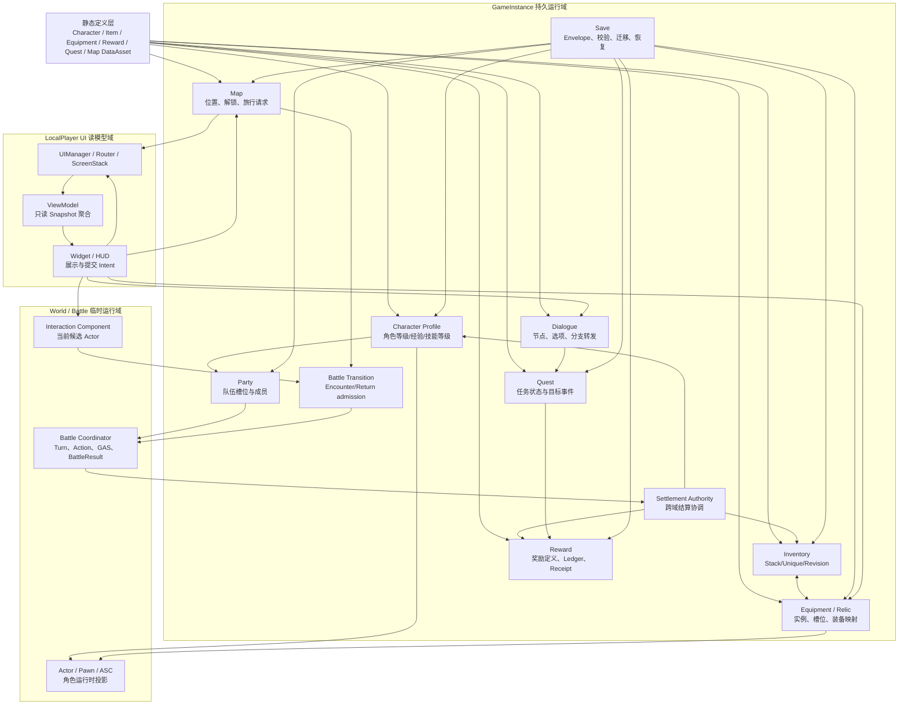
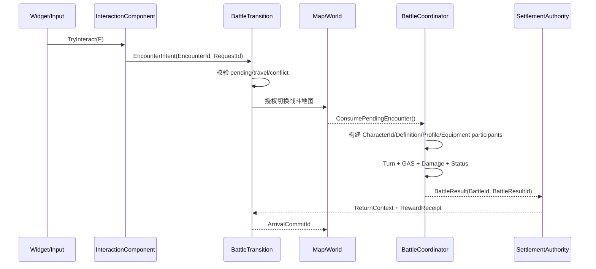
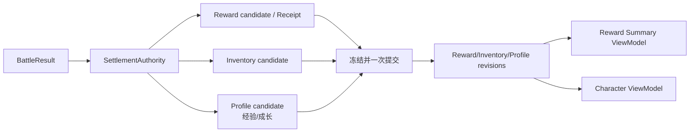
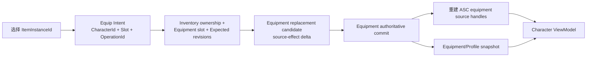
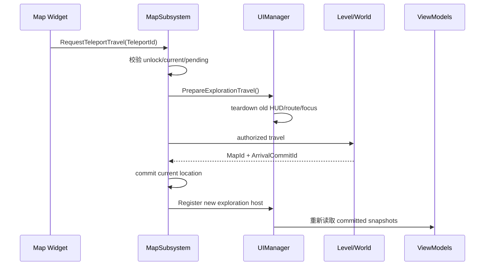
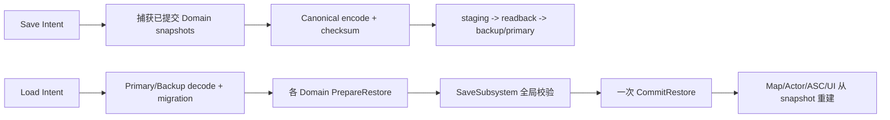

# HSR 子系统关系图与数据流动图

本文基于 `docs/subsystem-architecture-and-usage.md` 与 `docs/system-operation-flow.md`，描述当前单机架构中各子系统的依赖关系、权威边界和典型数据流。

## 1. 子系统关系图

图中箭头表示“调用或读取关系”，不表示被调用方失去自己的数据所有权。每个 GameInstance Domain 仍是自己的唯一权威；Actor、ASC、Widget 都是投影或读模型。

## 2. 统一数据流动模型

```mermaid
flowchart LR
    Input["用户输入 / Widget"]
    Intent["纯值 Intent\nStable ID + OperationId"]
    Preflight["Authority Preflight\n上下文、权限、Revision"]
    Candidate["Candidate 构造\n不修改 live state"]
    Validate["完整校验"]
    Commit["一次权威 Commit"]
    Result["Typed Result\nRevision / TransactionId"]
    Event["Committed Event"]
    Snapshot["只读 Snapshot"]
    VM["ViewModel"]
    View["Widget 展示"]

    Input --> Intent --> Preflight --> Candidate --> Validate
    Validate -->|失败：零污染| Result
    Validate -->|通过| Commit --> Result --> Event --> Snapshot --> VM --> View
    Result -->|失败| VM
```

约束：Commit 前可以失败并保持 live state 不变；Commit 后 UI 失败只影响展示，不能回滚已提交业务状态。

## 3. 典型业务数据流

### 3.1 探索交互进入战斗

### 3.2 战斗结算到奖励、背包和成长

### 3.3 装备变更到 ASC 投影

### 3.4 地图旅行与 UI 重建

### 3.5 Save / Load 全局恢复

## 4. 跨系统数据对象

| 数据对象 | 主要流经系统 | 用途 |
|---|---|---|
| `CharacterId` | Profile → Party/Equipment/Battle/Actor/UI | 稳定角色身份 |
| `ItemDefinitionId` / `ItemInstanceId` | Definition → Inventory/Equipment/Reward | 区分物品规则与实例 |
| `OperationId` | UI/Interaction → Authority | 用户意图去重与冲突检测 |
| `EncounterRequestId` / `BattleId` | Interaction → Transition → Battle | 战斗准入与 exactly-once |
| `RewardTransactionId` / `ClaimId` | Battle/Quest → Reward/Settlement | 奖励幂等与收据 |
| `MapId` / `ArrivalCommitId` | Map/Transition → World/UI | 跨地图到达确认 |
| `Revision` | 各 Domain → ViewModel/Save | 并发校验与快照刷新 |
| `SaveId` / `Generation` | Save ↔ 全部持久 Domain | 存档代际、校验和恢复 |

## 5. 阅读要点

- Widget 不直接修改 Gameplay、Inventory、Equipment、Save，也不直接 `OpenLevel`。
- 跨两个以上 Domain 的原子业务由 `SettlementAuthority` 或 `SaveSubsystem` 协调。
- World Actor、Pawn、ASC 和 HUD 可销毁并重建；持久状态只通过稳定 ID、纯值请求和 Snapshot 传递。
- 所有失败路径都应保持零污染，并通过 typed result、revision 和事件让 UI 重读权威快照。
